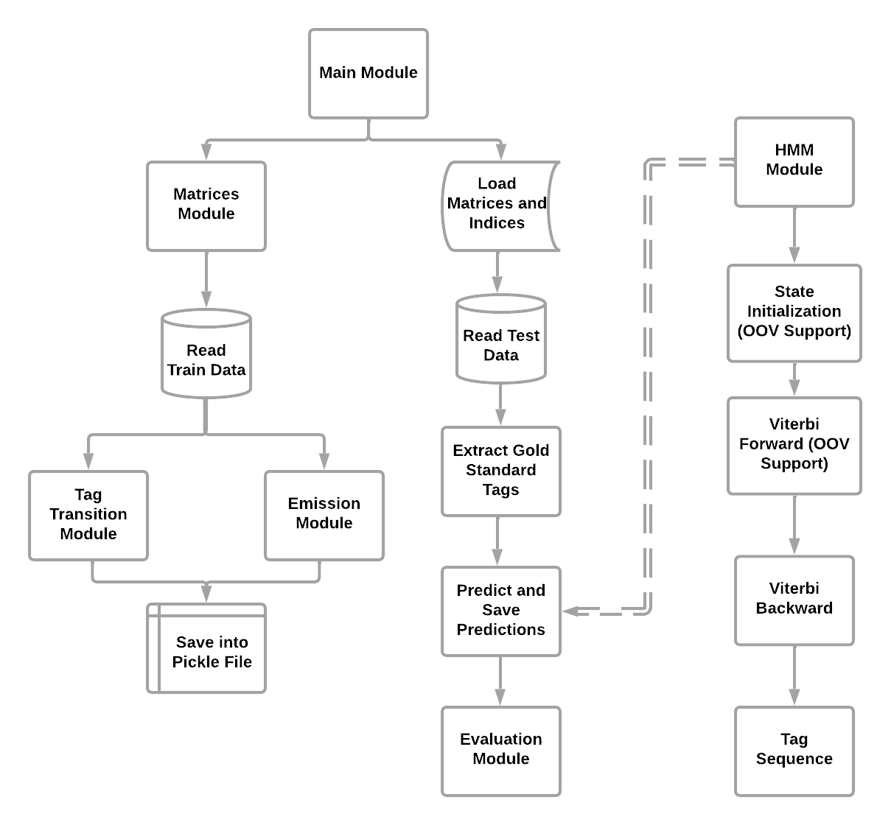

# tagTeam

Computational Linguistics Team Laboratory Project on Part-Of-Speech Tagging.

## Team Members

- [Chibundum Adebayo]
- [Hao-En Hsu]

## Project Milestones

- [x] Project Setup
- [x] Evaluation implementation for POS tagging
- [x] Baseline POS tagger algorithm **(Hidden Markov Model)**

## Evaluation Results

**Evaluation results for the Test and dev data:**

- Smoothing Parameter Value: **0.0001**
- Dev data F1 Score: **0.93**
- Test data F1 Score: **0.94**

## Project Setup

> :warning: **IMPORTANT: Please adjust the file paths in the `main.py (Line 18)` and `matrices.py (Line 25)` files to the appropriate paths on your local machine before running the program.**

```python
python3 -m venv team_lab
source team_lab/bin/activate
pip install numpy

# Run the program and it generates the evaluation results and predictions
python3 main.py
```

> - The predictions for the test and dev data will be saved in the **test_predictions.txt** and **dev_predictions.txt** file respectively
> - The evaluation results are stored in the **evaluation_results.txt** file.

1. Libraries Used:
   - Python (3.12.3)
   - Numpy (1.26.4)
2. Overview:
   This project implements a Hidden Markov Model (HMM) based Part-of-Speech (POS) tagger, which assigns a POS tag to each word in a given input sentence. The model utilizes probabilistic approaches to determine the most likely sequence of POS tags based on observed words and transition probabilities between tags, which is decoded by Viterbi algorithm, a dynamic approach frequently used in POS tagging and NER recognition.
3. Module Structure:
   - data.py: Reading data files in the CoNLL format and extracting tokens and tags for evaluation purposes
   - evaluation.py: Evaluating the performance of the POS tagger using metrics including precision, recall, and **micro averaging** F1-score
   - tag_transition.py: computing the transition probabilities between POS tags
   - emission.py: Constructing the emission matrix, which contains the probabilities of emitting each word from each POS tag
   - matrices.py: Building transition and emission matrices from the training data and saving them to files
   - hmm.py: Implementing the Viterbi algorithm for POS tagging using HMM.
   - pred_eval.py: Predicting POS tags for sentences and evaluating the predicted tags against the gold standard tags
   - main.py: Executing the HMM POS tagger and evaluateing its performance
4. Run the following command to execute the program and get the evaluation results as well as the predictions for the appropriate data:
   `python3 main.py`
5. **The predictions for the test and dev data will be saved in the `test_predictions.txt` and `dev_predictions.txt` file respectively, and the evaluation results are stored in the `evaluation_results.txt` file.**

## BERT POS tagger

- [x] German
- [x] English
- [x] Mandarin

## Evaluation Results

**Evaluation results (F1 score) for the dev data:**

- German (3 epochs): **0.9388**
- English (10 epochs): **0.9176**
- Mandarin (10 epochs): **0.7900**

## Transfer Learning

- [x] Afrikaan


## Evaluation Results

**Evaluation results (F1 score) for the dev data pretrained on different languages:**

- German (10 epochs): **0.9388**
- English (10 epochs): **0.9176**
- Mandarin (10 epochs): **0.7900**

> **IMPORTANT: Please adjust the file paths in `BERTtagger.py (Lines 31-33, 36-38, 41-43)`, the language choice for BERT taggers in the `BERTtagger.py (Line 301)`, pretrained models paths in `TL_Afrikaan.py (Lines 209-211)` and finetune file paths in `TL_Afrikaan.py (Lines 26-28)`  to the appropriate paths on your local machine before running the program.**

```python
python3 -m venv team_lab
source team_lab/bin/activate
pip install numpy

# Run the program and it generates the evaluation results and predictions
python3 main.py
```

> - The predictions for the test and dev data will be saved in the **test_predictions.txt** and **dev_predictions.txt** file respectively
> - The evaluation results are stored in the **evaluation_results.txt** file.

1. Libraries Used:
   - Python (3.12.3)
   - Numpy (1.26.4)
2. Overview:
   This project implements a Hidden Markov Model (HMM) based Part-of-Speech (POS) tagger, which assigns a POS tag to each word in a given input sentence. The model utilizes probabilistic approaches to determine the most likely sequence of POS tags based on observed words and transition probabilities between tags, which is decoded by Viterbi algorithm, a dynamic approach frequently used in POS tagging and NER recognition.
3. Module Structure:
   - data.py: Reading data files in the CoNLL format and extracting tokens and tags for evaluation purposes
   - evaluation.py: Evaluating the performance of the POS tagger using metrics including precision, recall, and **micro averaging** F1-score
   - tag_transition.py: computing the transition probabilities between POS tags
   - emission.py: Constructing the emission matrix, which contains the probabilities of emitting each word from each POS tag
   - matrices.py: Building transition and emission matrices from the training data and saving them to files
   - hmm.py: Implementing the Viterbi algorithm for POS tagging using HMM.
   - pred_eval.py: Predicting POS tags for sentences and evaluating the predicted tags against the gold standard tags
   - main.py: Executing the HMM POS tagger and evaluateing its performance
4. Run the following command to execute the program and get the evaluation results as well as the predictions for the appropriate data:
   `python3 main.py`
5. **The predictions for the test and dev data will be saved in the `test_predictions.txt` and `dev_predictions.txt` file respectively, and the evaluation results are stored in the `evaluation_results.txt` file.**




